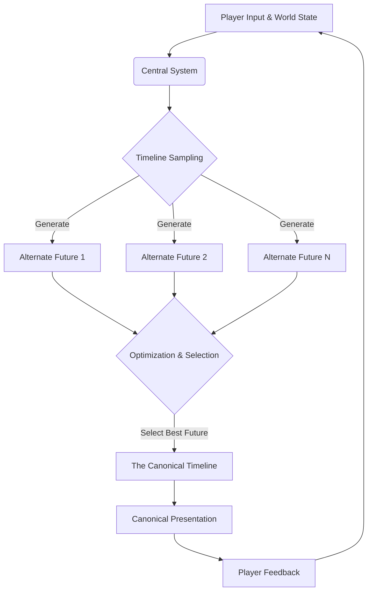
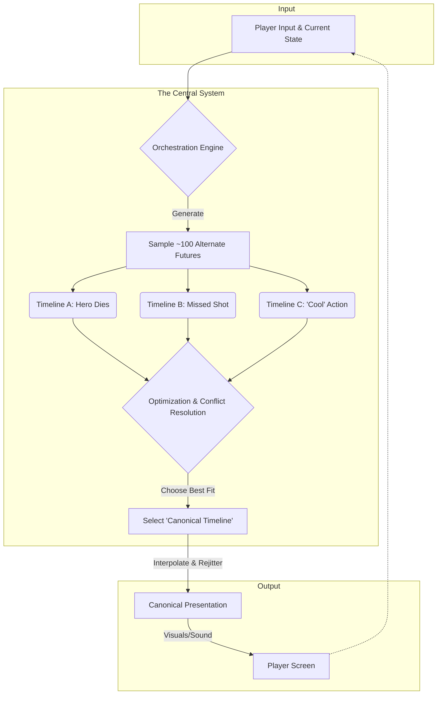
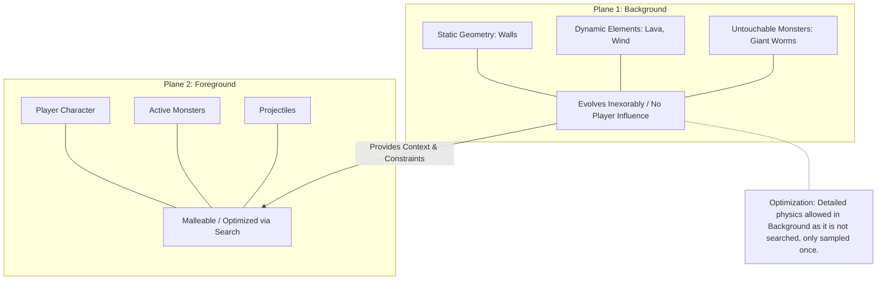
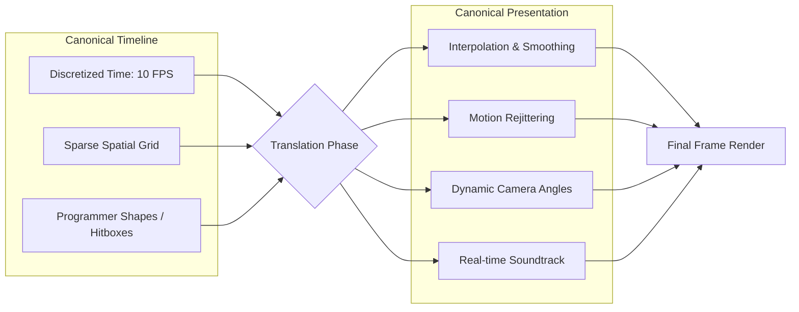
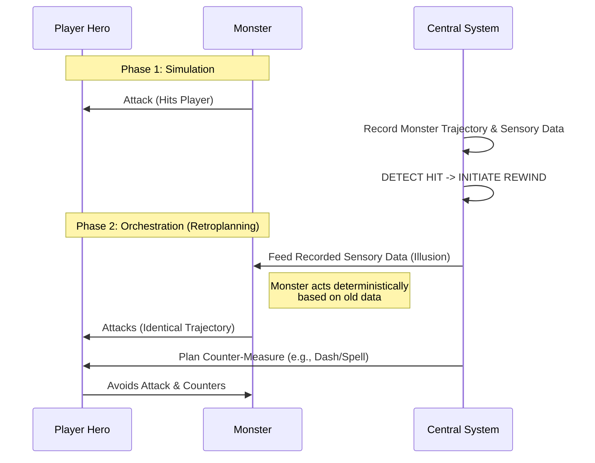
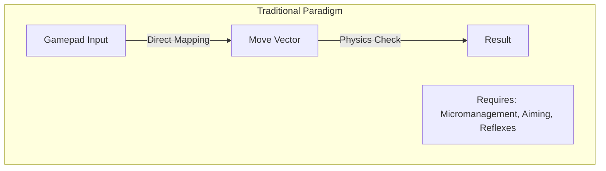
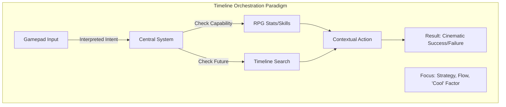

# Timeline Orchestration

## A New Paradigm for Game Design and Technology

This is FunTOR, the central repository of **timeline orchestration**,
which is a game design and technology paradigm.
Implementations of the various relevant algorithms will be prepared
here in the Rust programming language under a permissive open source license.

## The Road Forward to Cinematic Tactics

We describe a game design and technological paradigm in which
a **central planning system** controls and orchestrates all aspects of gameplay.

Control is established primarily over the **time dimension** by sampling
and searching entire timelines. Each timeline represents a possible continuation
of gameplay to a tactical horizon of approximately **1–3 seconds**.

## The Central System and the Canonical Timeline

The central system orchestrates gameplay by establishing a **canonical timeline**,
which defines the authoritative future that immediate gameplay follows.

The canonical timeline is continuously evolving and may change abruptly as the central system
responds to player input and as the planning horizon advances.

Where a traditional engine evolves a single game-world state forward in time,
a **temporal mechanics engine** evolves a *whole timeline* of world states:
the canonical timeline.

The canonical timeline is established by wholesale sampling and searching
of many alternate futures. These unrealized futures are a rich source
of information about the dynamics of the game world.

---

## Timeline Orchestration

The canonical timeline is selected using customized **sampling, search, and optimization algorithms**.
In an action game, the system may examine on the order of a hundred complete timelines during
a single planning cycle, repeated roughly ten times per second.

The generation of a candidate timeline involves several optimization phases.
At no point is adversarial optimization employed. Everything is accomplished
using simple heuristic state space search.

Like a movie director, the system aims to choreograph a timeline that is exciting and coherent
while remaining faithful to the internal logic of the game world. We refer to this approach as
**timeline orchestration**.

Unlike heuristic planning approaches that construct partial or conflicting plans, the central
system plans ahead using the *entire game state*. Conflict resolution is therefore an intrinsic
part of planning rather than an afterthought.

The central system’s principal advantage is **foreknowledge**: it has a concrete understanding
of what is likely to happen in the next few moments. From this alone, it can plan experiences
that are difficult or impossible to achieve in other paradigms, such as:

- Cinematic action sequences
- Dramatic camera choreography
- Soundtracks composed and timed in real time

Every sampled but unrealized timeline provides **counterfactual information**. For NPCs,
this information can be translated into awareness, anticipation, and dialogue that reflect
knowledge of near-miss futures.

The purpose of the central system is not merely to simulate or enforce rules, but
to **invent absorbing gameplay**. The internal logic of the game world is preserved
to maintain meaningful player choice, but within those boundaries, sampling and optimization
impart a new fluency to play.

---

## Tactical Control and Player Agency

Player control is always mediated and interpreted by the central system.
The goal is not to wrest control away from the player, but to impart meaning and flow
by freeing the player from micromanagement tasks such as:

- Precise aiming
- Frame-perfect dodging
- Fidgety platforming

Player choices are amplified into impressive tactics, revealing the underlying
tactical tapestry of the game. This allows the player to focus on
**strategic and tactical decisions** within a rhythm designed to match the spirit of the game.

Tactical control encourages us to discard busywork that exists only to distract
players from shallow systems, and instead to create genuine meaning through deeper mechanics.

Because the central system operates explicitly in the time dimension and mediates all control,
it effectively defines the **true mechanics** of the game.

High-level prescriptions can be applied directly (e.g., “this attack has a 50% chance of success”)
or derived from tactical information uncovered during planning, with minimal reliance on prescriptive
mechanics.

For example, the system can detect that the player character is likely to perish in the near future
and issue warnings or adjust difficulty accordingly. It can estimate success probabilities for
encounters or events in advance and tune outcomes to match intended difficulty.

---

## Decoupling Control, Action, and Interface

Decoupling control from action enables a wide variety of **interfaces and control styles**
under a single central system.

Control schemes are a deep feature of design. By decoupling control and execution,
we can support unique control styles while reducing production costs.

Direct control offers limited expressiveness: moving a gamepad directly moves the player character.
Tactical control allows richer interpretations of input:

- Goals
- Emotions
- Powers
- Motivations

Role-playing becomes flexible and automatic, as tactical competence
is a property of the character rather than the player’s physical skill.

Tactical control allows players to command characters that are:

- Physically too complex for direct control
- Demanding elite execution skills
- Encumbered by quirks or afflictions

This enables accessibility even in fast-paced action games.

---

## Discretization and Efficiency

We noted that the central system plans with the full game state. For this reason,
it is imperative to discretize both **space and time** as sparsely as possible and pare away
everything nonessential. Only tactically relevant features should be left for the planning
system. We discretize time typically to 10 frames per second, which are
then interpolated and rejittered for the final presentation.

Spatial discretization preserves relationships required by design, while cosmetic detail
is filled in by the presentation system. The sparser the discretization, the more futures
can be explored.

Direct-control games demand higher precision because the player interacts directly
with presentation. The central system tolerates imprecision and simplified collision geometry,
gaining efficiency to offset the cost of timeline sampling.

---

## Collaborative Future Search

Future search is collaborative rather than adversarial. Everything in the game world participates
in a central choreography defined by the canonical timeline.

Monsters collaborate in being defeated; heroes are competent, resourceful, and fortunate.
Adversarial min–maxing is limited or eliminated, often replaced by **retroplanning**,
which converts adversarial problems into optimization problems.

---

## Environment Dynamics: Foreground and Background

The game state is divided into overlapping planes:

### Background

Elements influenced only sparsely by the player:

- Level geometry
- Fixed structures
- Large-scale dynamics (wind, lava, massive creatures)

The background evolves largely independently and is simulated along a single chosen timeline.
Typically, influencing the evolution of the background involves explicit player intervention.

### Foreground

Elements requiring flexibility during planning:

- Player characters
- NPCs
- Monsters

The background timeline is established first and then referenced during foreground orchestration.
This allows detailed background simulations (e.g., fluid dynamics) to inform tactical planning
without exploding computational cost.

---

## Translation to Canonical Presentation

Translation from the canonical timeline to graphics and sound is a distinct optimization phase.
It reconstructs a continuous, detailed reality from a heavily discretized representation.

This phase may:

- Interpolate motion
- Add dramatic camera work
- Compose adaptive soundtracks
- Retime or rejitter movement

The final audiovisual output is called the **canonical presentation**. The player perceives
only its leading edge, which may change abruptly as the canonical timeline updates.

---

## Automatic Content Generation

Sparse discretization and rapid simulation enable **automatic level generation**
by exploring and optimizing local tactical opportunities.

Automatic playtesting is a natural extension of the planning system,
as gameplay outcomes are efficiently sampled and evaluated.

Strategic and tactical proxies (e.g., pathfinding metrics) guide early generation phases,
with full automatic playtesting used for final tuning.

---

## Main Features of Timeline Orchestration

- Automatic, cinematic tactics
- Diverse interfaces and accessibility
- Rich role-play with complex attributes and powers
- Smooth coordination of squads, crowds, traffic, and stealth
- Safe co-op and automatic anti-griefing
- Intelligent, anticipatory NPCs
- Simulation of luck, precognition, and time-based effects
- Rich environment dynamics
- Cinematic presentation and real-time soundtracks
- Automated level design and playtesting
- High technical complexity deterring trivial imitation

---

## Retroplanning and Reality Orchestration

Retroplanning evolves timelines by observing outcomes, rewinding time,
and resimulating with improved plans. Entities may be fed sensory data
from alternate realities to control behavior.

When undesirable outcomes occur, time is rewound and parts of the timeline
are frozen to simplify planning. Successful outcomes are locked in,
allowing mixing of real and illusory trajectories.

Because prolonged divergence would cause incoherence, retroplanning
is applied frequently in small adjustments.

### Retrofitting

Retrofitting defers decisions until outcomes are measurable, then
alters the timeline retroactively. For example, a projectile may be
fired retroactively in the past, once the future location of the
target is known.

This supports probability-based rules and RPG-style mechanics
while improving efficiency.

---

## Themes

- Direct Control → Tactical Control
- Simulation → Timeline Orchestration
- Present State → Canonical Timeline
- Heuristic AI → Timeline Search
- Manual Playtesting → Automated Playtesting and Content Generation

---

## Summary

### Algorithmic Consequences

- Sparse discretization of time, space, and character dynamics
- Simplified physics and collision geometry
- Retroplanning and retrofitting
- Counterfactual information from sampling
- Presentation optimization of canonical timelines
- Scaffolding for automatic content generation

Our central goal is to find economically viable ways to create richer,
more immersive games through novel design methodology and technology.

By taking control of the time dimension, games can become as well orchestrated
as films while preserving the depth that makes them interactive and satisfying.

---

## Replanning: The Past Relaxation Algorithm

The central planning algorithms are straightforward and efficient,
relying on replanning and retrofitting enabled by treating the timeline
as a first-class object.

The *Past Relaxation* algorithm operates as follows:

1. The player is attacked and harmed in an initial simulation.
2. The system records the attacker’s behavior.
3. Time is rewound.
4. The player’s actions are replanned using foreknowledge.
5. The attack is resimulated, feeding the attacker sensory data from the original attack.

The attacker behaves identically, but the player now executes planned
countermeasures. After the interaction, normal sensing resumes.

The countermeasures are optimized to alter the original timeline as little
as possible, maintaining coherent action while making the player character
seem resourceful, lucky and competent.

This mirrors the choreography of action cinema, where outcomes are known
in advance and mayhem is carefully staged. Rewinding time is cheap,
efficient, and powerful. Player action planning uses a simple state
space search.

---

## Closing Statement

By orchestrating entire timelines rather than reacting to the present,
we unlock new capabilities in gameplay, accessibility, presentation,
and content creation.

Timeline orchestration offers a generic technique for improving gameplay,
a method for cinematic action, and a unifying framework for future game design.

